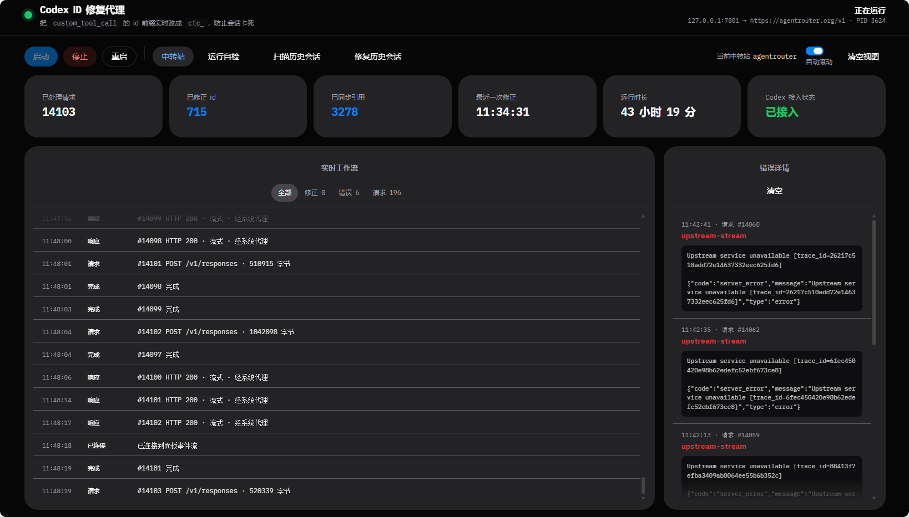

[](https://lao1.me)

# Codex ID-Sanitizing Proxy

[中文](README.md) · **English**

Fixes and prevents Codex sessions bricked by a relay's id validation, and turns
"switch relay" into a single click.

> The dashboard UI is in Chinese. Everything else — code, comments, CLI output —
> is English.

## The one-line reason

A relay sometimes returns a `custom_tool_call` whose id starts with `fc_` or
`item_`, while the Responses API requires `ctc_`. Codex stores whatever it
receives, replays the whole history every turn, and from then on every request
gets a 400 — the session is stuck for good.

This proxy sits between Codex and the relay and rewrites ids in both directions:

```
Codex ──► 127.0.0.1:7801/v1 (proxy) ──► system proxy 7897 ──► active relay
              ▲ outbound: fix history / inbound: fix responses
```

- **Outbound** — bad ids in the replayed history are corrected, so a session
  that is already poisoned keeps working.
- **Inbound** — rewritten inside the SSE stream, so Codex's in-memory history is
  clean from the start and never persists new bad data.

## Requirements

- **Windows.** The control panel uses `netstat` to find the proxy process and a
  `.vbs` to start it without a console window; those two parts are
  Windows-specific. The proxy itself (`id-sanitizing-proxy.mjs`) is portable.
- **Node 20+.** Editing the UI needs 20.19+ (a Vite 8 requirement).
- **Codex CLI**, currently reaching models through a relay.

## Install

```bash
git clone https://github.com/BingLi37/codex-fix.git
cd codex-fix
```

The built UI (`ui/dist`) is committed, so **it works as-is — no npm install**.
You only need `cd ui && npm install` to change the UI.

Then three steps:

**1. Add your relay.** Double-click `启动控制面板.cmd` ("start control panel"),
open <http://127.0.0.1:7800>, click 「中转站」(Relays) → 「添加」(Add), and enter
the base URL and key you use today.

**2. Point Codex at the proxy.** In `~/.codex/config.toml`:

```toml
[model_providers.custom]
base_url = "http://127.0.0.1:7801/v1"
```

Back the file up first. The 「Codex 接入状态」(Codex wiring) banner at the top of
the panel tells you whether this line matches.

**3. Optional — start at logon.** Press `Win+R`, type `shell:startup`, and drop a
shortcut to `autostart-hidden.vbs` in there. It locates the project directory and
node by itself, with no absolute paths baked in. The proxy then runs in the
background without opening the UI.

## Usage

Double-click `启动控制面板.cmd`; the browser opens <http://127.0.0.1:7800>.



From the panel: start/stop/restart the proxy, switch relays, see whether it is
working, watch the live event stream (every repair shows `bad id → good id`),
read error details (including the relay's raw response body), run the self-test,
and scan or repair historical session files.

## Switching relays

**Codex's `base_url` is now permanently `http://127.0.0.1:7801/v1` — you never
edit `config.toml` again.**

The real relay addresses live in `relays.json` (created on first save, and
gitignored); the proxy forwards to whichever is active. Click 「中转站」in the
panel:

- **Switch** — takes effect immediately. No proxy restart, no Codex restart.
- **Add** — saves only; it does not activate. Click Switch when you want it.
- **API key** — leave empty to keep using Codex's own key (`auth.json`); fill it
  in to override, so switching relays never means editing `auth.json`.
- **Test** — really sends a request to that relay's `/models`, through the same
  path as live traffic. A 401 means it is reachable but the key is wrong — and if
  this relay intentionally has no key because Codex supplies it, a 401 is normal.

Base URL paths are mapped automatically: Codex asks for `/v1/responses`, and if
the relay is `https://x.com/api/v3` the request goes to
`https://x.com/api/v3/responses`.

**So the base URL must include its path prefix.** Entering `https://x.com` sends
to `https://x.com/responses` (no `/v1`), which most relays reject. Copy the full
address the relay gave you.

## Reading the other errors

The panel shows the relay's raw response body in full. Three common errors:

| Error | Meaning | What to do |
| --- | --- | --- |
| `Expected an ID that begins with 'ctc'` | wrong id prefix | fixed automatically, ignore it |
| `was provided without its required 'reasoning' item` | the relay rejected one tool call's id | retried with a fresh id and remembered, ignore it |
| `No tool output found for function call` | a tool call is missing its output | a history-assembly problem; the proxy stays out of it |

What testing showed about the second one: the error message itself is misleading.

- It claims a reasoning item is missing, but **that reasoning item is in the
  request** — correct position, `encrypted_content` present.
- Replacing only the reasoning id → still rejected.
- Replacing only **the tool call's own id** (leaving the reasoning id and
  `call_id` untouched) → **accepted**.

So the problem is not the local history: the relay's upstream holds a bad record
for that id. Both `function_call` and `custom_tool_call` are affected, and each
must keep its own `fc_` / `ctc_` prefix.

The proxy handles it in two steps:

1. **On rejection**, retry with a fresh id for that call (up to 8 times). The
   relay reports one bad id at a time and a poisoned history can hold several —
   one observed session had 5 replaceable tool calls — so it has to be able to
   swap them in sequence.
2. **Remember those ids** and rewrite them before the request goes out, skipping
   the retries entirely. That blacklist lives in `logs/poisoned-ids.json` and
   survives restarts.

Measured: the first turn took 4 upstream requests (1 original + 3 retries) to
find the bad ids; from the second turn on, **1 request**. Still 1 after a restart.

**These limits do not fire every time.** A relay fronts several upstreams, and
only the strict one complains. The same history can pass one minute and fail the
next, which is why the blacklist only gets more accurate over time.

## Prefixes are messier than they look

This started as `custom_tool_call` only, because all 2280 prefix rejections on
record wanted `ctc`. Then the relay began rejecting other types and that reason
stopped holding. Each type is now handled separately:

| Type | Required prefix |
| --- | --- |
| `custom_tool_call` / its output | `ctc_` / `ctco_` |
| `function_call` / its output | `fc_` / `fco_` |
| `message` | `msg_` |
| `reasoning` | see below |

`reasoning` is the exception, because two backends want contradictory things:

- One rejects the `item_` prefix: `Expected an ID that begins with 'rs'`
- After switching to `rs_`, the other rejects it: `Item with id 'rs_…' not found.
  Items are not persisted when store is set to false`

Neither rewrite works for the same id. The difference is whether the item carries
`encrypted_content`:

- **It does** → the item is real, so rewrite the prefix to `rs_`.
- **It does not** → the server has no record of it at all, `rs_` could never
  resolve, so **drop the id entirely**.

Dropping the id triggers neither error: no prefix to validate, no id to look up.
The real item that produced both errors (no `encrypted_content`) now passes.

## "History anomaly" in the event stream

On a rejection the proxy logs one extra entry stating facts rather than guesses:
whether the reasoning id the relay asked for is present in the request, its
position, and whether it has `encrypted_content`. Four cases map to four
different conclusions, all covered by tests.

## Flaky connections (nothing to do with ids)

`ECONNRESET — socket hang up` in the logs is not an id problem; it is the system
proxy or the relay dropping the connection. Measured rates:

| Request size | ECONNRESET |
| --- | --- |
| <100KB | 2% |
| 100KB–1MB | 4–5% |
| >1MB | 6% |

The proxy responds by retrying once with a direct connection, which recovers
about **two thirds** of them (210 of 328 eventually succeeded).

There is also an **idle timeout** (120s by default). One request once hung for
5847 seconds — 97 minutes — because the upstream connection had died and nothing
closed it. The timeout measures *time without any data*, not total duration, so
slow-but-alive streams are unaffected (a 10.6s stream finished fine under a 3s
budget).

To change it: `CODEX_ID_PROXY_IDLE_MS=180000`.

## Overhead

Measured against a local fake upstream (median of 25 runs per size, proxy
overhead only, relay latency excluded):

| Scenario | Direct | Through proxy | Overhead |
| --- | --- | --- | --- |
| 8KB request / 100 tokens | 1.9ms | 5.4ms | +3.5ms |
| 200KB request / 400 tokens | 5.8ms | 14.7ms | +8.9ms |
| 680KB request / 1500 tokens | 14.4ms | 36.0ms | +21ms |

A real request measures 5–7 seconds, so this is roughly **0.4% overhead** —
imperceptible.

Outbound requests are now always parsed, with no fast-path pre-filter, because
missing one prefix bricks the session and that matters more than a few
milliseconds. The fast path is kept only for SSE streams, where hundreds of token
deltas arrive per second.

Re-measure it yourself with `node bench.mjs`.

## Files

| File | Role |
| --- | --- |
| `id-sanitizing-proxy.mjs` | the proxy; all id-rewriting logic lives here |
| `relay-config.mjs` | relay config read/write, path mapping, `CODEX_HOME` lookup |
| `relay-probe.mjs` | one-shot probe used by the connectivity test |
| `id-sanitizing-proxy.test.mjs` | proxy self-test, 45 cases |
| `repair-ctc-ids.mjs` | bulk-repair rollout files already written with bad ids |
| `control-panel.mjs` | control panel server (7800); also starts the proxy |
| `bench.mjs` | benchmark |
| `ui/` | HeroUI + React dashboard source; `ui/dist` is the committed build |
| `ui/src/App.test.jsx` | UI interaction tests, 24 cases |
| `ui/src/promo-card.js` | the promo card in the bottom-right corner |
| `dashboard-fallback.*` | dependency-free simple dashboard, used automatically when `ui/dist` is missing |
| `启动控制面板.cmd` | entry point: starts the panel if it isn't up, then opens the browser |
| `autostart-hidden.vbs` | starts the panel with no console window; locates the project dir and node itself |

Generated at runtime and **not committed** (see `.gitignore`):

| File | Role |
| --- | --- |
| `relays.json` | relay list and the active one (contains the API key, in plaintext) |
| `logs/events.jsonl` | structured events; this is what the dashboard reads |
| `logs/poisoned-ids.json` | ids the relay has rejected, rewritten before requests go out |

## Command line

```bash
node id-sanitizing-proxy.test.mjs        # proxy self-test (45 cases)
node repair-ctc-ids.mjs                  # scan historical sessions, changes nothing
node repair-ctc-ids.mjs --apply          # repair; originals backed up to ~/.codex/backups
node bench.mjs                           # benchmark
curl http://127.0.0.1:7801/__id_proxy_health

cd ui && npm test                        # UI tests (24 cases)
cd ui && npm run build                   # required after any UI change
```

Environment variables:

| Variable | Default | Role |
| --- | --- | --- |
| `CODEX_HOME` | `~/.codex` | Codex data directory, for reading `config.toml` and `sessions/` |
| `CODEX_PANEL_PORT` | `7800` | control panel port |
| `CODEX_ID_PROXY_PORT` | `7801` | proxy port |
| `CODEX_RELAY_CONFIG` | `./relays.json` | relay config file location |
| `CODEX_ID_PROXY_IDLE_MS` | `120000` | upstream idle timeout |
| `HTTPS_PROXY` | `http://127.0.0.1:7897` | system proxy used for upstream traffic |
| `CODEX_NODE_EXE` | auto-detected | which node `autostart-hidden.vbs` uses |

## Notes

- **If the proxy is not running, Codex cannot reach the model.** The panel's
  「Codex 接入状态」banner shows whether `base_url` in `config.toml` still matches.
- **Switching relays affects an in-flight conversation immediately.** Switch to
  the wrong one and you will see a burst of errors; switch back and it recovers.
- The API key in `relays.json` is stored in plaintext, same as `auth.json`. Other
  programs on this machine can read it.
- A dead system proxy (7897) does not take Codex down; the proxy falls back to a
  direct retry.
- Prefixes are fixed per type; `reasoning` either gets an `rs_` prefix or loses
  its id, depending on whether `encrypted_content` is present.
- To back all of this out: point `base_url` in `config.toml` back at the relay and
  delete the shortcut from your Startup folder.
- `ui/node_modules` is ~300MB and only needed for UI work.

## License

The code is MIT — see `LICENSE`.

The fonts under `ui/public/fonts` (and the build copy in `ui/dist/fonts`) are
third-party Font Software and are **not** covered by the MIT license: iA Writer
Quattro S, IBM Plex and Lilex are all distributed under the SIL Open Font
License 1.1. The copyright notices and full license text are in
`ui/public/fonts/LICENSE.txt`, which must travel with the font files.
